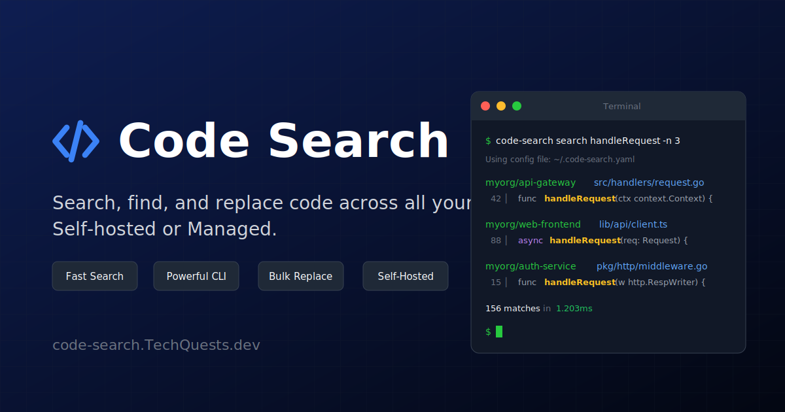

# Code Search

[](https://opensource.org/licenses/Apache-2.0)



**Search, find, and replace code across all your repositories in milliseconds.**

A self-hosted code search and bulk operations platform. Powered by Zoekt (the same search engine Google uses internally), designed for teams that need speed, privacy, and control.

## Features

- **Lightning Fast Search** — Sub-second search across millions of lines of code
- **Bulk Replace** — Find and replace across hundreds of repos with automated MR/PR creation
- **Privacy First** — Self-hosted on your infrastructure; your code never leaves your servers
- **Multi-Platform** — GitHub, GitLab, Gitea, and Bitbucket support
- **Developer Experience** — Modern Web UI and powerful CLI for automation

## Enterprise Features (Paid)

For organizations that need advanced security and governance, we offer a paid **Enterprise Edition**. It includes:

- **OIDC Single Sign-On** — Integrate with Okta, Azure AD, Google Workspace, and more.
- **Role-Based Access Control** — Fine-grained repository permissions with glob patterns.
- **Audit Logging** — Full compliance trail of searches, file access, and administrative actions.
- **Horizontal Scaling** — Scale to thousands of repositories with sharded indexing and API servers.
- **License Management** — Centrally manage seats and feature access.

**[View Enterprise Pricing & Features →](https://code-search.techquests.dev/enterprise/overview/)**

## Quick Start

Get searching in 2 minutes with Docker:

```bash
# Download and start all services
curl -O https://raw.githubusercontent.com/techquestsdev/code-search/main/docker-compose.yml
docker compose up -d

# Open the web UI
open http://localhost:3000
```

Then:

1. Go to **Connections** → **Add Connection**
2. Add your GitHub/GitLab token
3. Click **Sync** to discover repositories
4. Start searching!

**[Full Quick Start Guide →](https://code-search.techquests.dev/getting-started/quick-start/)**

## CLI Usage

The CLI is designed for power users and CI/CD automation:

```bash
# Search across all repositories
code-search search "deprecated_function" --repos "myorg/*"

# Find and replace with automatic MR creation
code-search replace "v1.0.0" "v2.0.0" \
  --repos "myorg/*" \
  --execute \
  --mr-title "Upgrade to v2.0.0"

# Repository management
code-search repo list
code-search repo sync --all
```

**[CLI Documentation →](https://code-search.techquests.dev/cli/installation/)**

## Architecture

```txt
┌─────────────────────────────────────────────────────────────────┐
│                         Web UI / CLI                            │
└─────────────────────────────────────────────────────────────────┘
                                │
                                ▼
┌─────────────────────────────────────────────────────────────────┐
│                          API Server                             │
└─────────────────────────────────────────────────────────────────┘
               │                │               │
               ▼                ▼               ▼
       ┌──────────────┐ ┌──────────────┐ ┌──────────────┐
       │    Zoekt     │ │  PostgreSQL  │ │    Redis     │
       │(Search Index)│ │   (Data)     │ │   (Queue)    │
       └──────────────┘ └──────────────┘ └──────────────┘
               ▲
               │
┌─────────────────────────────────────────────────────────────────┐
│                      Indexer Service                            │
│        (Clones repos from GitHub/GitLab/Gitea/Bitbucket)        │
└─────────────────────────────────────────────────────────────────┘
```

## Development

**Prerequisites:** Go 1.21+, Node.js 20+, PostgreSQL 16+, Redis 7+

```bash
# Clone the repository
git clone https://github.com/techquestsdev/code-search.git
cd code-search

# Start infrastructure (PostgreSQL, Redis, Zoekt)
make dev-infra

# Build all binaries
make build

# Run services (in separate terminals)
make dev-api      # API Server → http://localhost:8080
make dev-indexer  # Indexer Service
make dev-web      # Web UI → http://localhost:3000
```

## Tech Stack

| Component         | Technology         | Purpose                          |
| ----------------- | ------------------ | -------------------------------- |
| **Backend**       | Go                 | High-performance API server      |
| **Frontend**      | Next.js            | Modern, responsive web interface |
| **CLI**           | Go + Cobra         | Fast, scriptable command line    |
| **Search Engine** | Zoekt              | Trigram-based code search        |
| **Database**      | PostgreSQL / MySQL | Reliable data persistence        |
| **Queue**         | Redis              | Job queue and caching            |

## Documentation

| Resource | Description |
|----------|-------------|
| **[Getting Started](https://code-search.techquests.dev/getting-started/introduction/)** | Introduction and quick start |
| **[Installation](https://code-search.techquests.dev/getting-started/installation/)** | Docker, Kubernetes, Helm guides |
| **[Configuration](https://code-search.techquests.dev/configuration/overview/)** | All configuration options |
| **[CLI Reference](https://code-search.techquests.dev/cli/installation/)** | Command line documentation |
| **[API Reference](https://code-search.techquests.dev/api/overview/)** | REST API documentation |
| **[Architecture](https://code-search.techquests.dev/architecture/overview/)** | System design and data flow |

## Contributing

We welcome contributions! Please see our **[CONTRIBUTING.md](CONTRIBUTING.md)** for details on the process and our **[Individual Contributor License Agreement (ICLA)](ICLA.md)**.

## License

This project is licensed under the Apache License 2.0 — see the [LICENSE](LICENSE) file for details.

## Acknowledgments

Built with inspiration from [Sourcegraph](https://github.com/sourcegraph/sourcegraph-public-snapshot) and powered by [Zoekt](https://github.com/sourcegraph/zoekt).

---

<p align="center">Made with ❤️</p>
